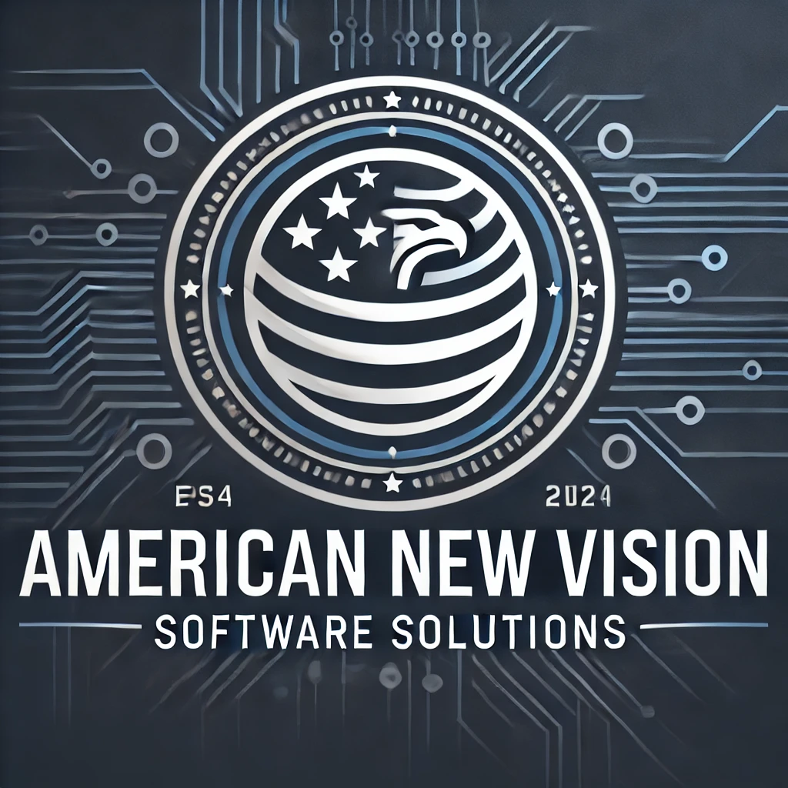

# Draft 01 - Capability Statement for RFI Contracting w/ GovTech Consortium

<aside>

## Table Of Contents:

### [Page 1: Cover Page](#cover-page) <!-- Completed -->

### [Page 2: Executive Summary](#executive-summary) <!-- Completed -->

### [Page 3: Core Competencies](#core-competencies) <!-- Completed -->

### [Page 4: Past Performance](#past-performance) <!-- Completed -->

### [Page 5: Differentiators](#differentiators) <!-- Completed -->

### [Page 6: Services Offered](#services-offered) <!-- Work in progress -->

### [Page 7: Contact Information](#contact-information) <!-- Work in progress -->

</aside>

<main>

## Home Page

 

**Company Name**: American New Vision LLC
**Title**: “Capability Statement”
**Email**: "americannewvision1@gmail.com"  <!--  TODO Replace -->
**Imagery**: Professional and relevant images that reflect your industry (e.g., technology, engineering).
**Contact Information**: 
P.O Box 1163 
Middletown Delaware
(302)3190857

## Executive Summary

### Business Overview

GovTech Consortium RFI Contracting specializes in providing cutting-edge technology solutions to government entities. Our expertise spans across software development, cybersecurity, and systems engineering, ensuring comprehensive support for digital transformation initiatives. With a focus on innovation and efficiency, we aim to deliver projects that exceed expectations, adhering to the highest standards of quality and security.

### Mission Statement

Our mission is to empower government entities with advanced technology solutions that drive efficiency, enhance security, and foster innovation. By leveraging our deep technical expertise and agile project management methodologies, we commit to delivering exceptional results that contribute to the success of our clients' missions.

#### Key Team Members:

- **Joshua Robbins**: Senior software developer with expertise in full-stack development, Java-based applications, and API design, specializing in secure backend systems and Agile methodologies.  
- **Moses A. Samuel**: Senior React Developer and full-stack engineer, skilled in building scalable front-end solutions with React and TypeScript, and backend services with Java and Python.  
- **Aamir Z. Cooper**: Security and network engineer with extensive experience in Risk Management Framework (RMF), vulnerability assessments, and maintaining secure classified and unclassified network infrastructures.  
- **Sean McEnany**: Lead Network Engineer with 12+ years of experience in network infrastructure design, optimization, and cybersecurity for government contracts, specializing in Cisco systems and data center high availability. 
 - **Arron Robbins**: Logistics and procurement manager with expertise in supply chain optimization, inventory management, and vendor relations, ensuring cost-effective and timely operations in fast-paced environments. 

Our team's collective expertise and dedication form the foundation of our ability to meet the complex needs of government contracts. We are committed to being a trusted partner in your digital transformation journey.

### Core Competencies

#### Team Technical Experience

Our team combines diverse expertise to deliver innovative IT solutions for government contracts. Using a range of modern technologies and best practices like modular design, CI/CD, and test-driven development, we create secure, scalable, and efficient systems. Guided by experienced professionals, we ensure high-performance, cloud-based deployments tailored to meet the unique demands of our clients.

### NACIS & SERVICES 

#### Primary NAICS Codes  
- **541512** – Computer Systems Design Services  
- **541511** – Custom Computer Programming Services  
- **541513** – Computer Facilities Management Services  
- **541519** – Other Computer Related Services  
- **518210** – Data Processing, Hosting, and Related Services  
- **541330** – Engineering Services  

#### Secondary NAICS Codes  
- **561621** – Security Systems Services (except Locksmiths)  
- **541690** – Other Scientific and Technical Consulting Services  
- **517311** – Wired Telecommunications Carriers  
- **517312** – Wireless Telecommunications Carriers (except Satellite)  
- **334111** – Electronic Computer Manufacturing  
- **611420** – Computer Training  
- **541618** – Other Management Consulting Services  
- **541715** – Research and Development in the Physical, Engineering, and Life Sciences (except Nanotechnology and Biotechnology)  

#### Our Team  

**Sean McEnany** - _Lead Network Engineer_  
Sean brings over 12 years of expertise in network infrastructure design, optimization, and cybersecurity. He is proficient in designing and maintaining high-performance networks, ensuring secure and reliable operations. Sean’s leadership and technical skills are instrumental in delivering scalable IT solutions tailored to government contracting needs.  

**Joshua Robbins** - _Senior Software Developer_  
Joshua specializes in full-stack development and backend solutions, with proficiency in Java, React, and API design. His expertise in creating secure, scalable applications and implementing Agile development practices enables our team to deliver reliable software solutions.  

**Aamir Z. Cooper** - _Security & Network Engineer_  
Aamir has extensive experience in cybersecurity and network management, including vulnerability assessments and Risk Management Framework (RMF) compliance. His work ensures the security and integrity of our systems, safeguarding critical infrastructure against threats.  

**Moses A. Samuel** - _Fullstack Developer & UX Designer_  
Moses is a skilled Fullstack Developer with a strong focus on frontend technologies like React and TypeScript, complemented by backend capabilities in Java and Python. His ability to design seamless, user-friendly applications ensures our solutions meet both technical and user experience standards.  

**Aaron Robbins** - _Logistics & Procurement Manager_  
Aaron excels in resource coordination, supply chain management, and logistics planning. With a background in optimizing operations and maintaining efficient workflows, he ensures projects run smoothly, meeting deadlines and budgetary constraints.  

**Isla Rowse** - _UI Designer & Content Specialist_  
Isla combines her skills in UI design and technical writing to create intuitive, visually appealing interfaces and clear, engaging content. Her attention to detail and creative approach enhance user experiences, ensuring project success in communication and presentation.  

#### Technical Skills Overview:

- _Robotics Engineering_: Experience and capabilities in robotics.
- _DevOps and Backend Development_: Proficiency in building and maintaining backend systems.
- _Security and Network Engineering_: Skills in securing and managing networks.
- _Fullstack Web Development_: Expertise in JavaScript frontends with React, Angular, and Node.js.

#### Technology Stack (Overview):

- Docker: Containerization for development and deployment.
- GCP (Google Cloud Platform): Cloud services and infrastructure.
- React, Angular, Node.js: Modern full stack web development technologies.
- Figma: A collaborative design tool used for wireframing, creating user stories, and managing design tokens. Figma enables seamless collaboration between designers, developers, and stakeholders, facilitating the creation of visually appealing and user-friendly digital experiences.

#### Technology Stack (For Development):

- _TypeScript_: A statically typed superset of JavaScript that ensures robust and maintainable code, enhancing developer productivity and code quality.
- _React_: A powerful JavaScript library for building dynamic user interfaces with a component-based architecture, ensuring high performance and scalability.
- _Redux_: A predictable state container for JavaScript applications, enabling consistent behavior across environments and simplifying application state management.
- Next.js: A popular React framework for building server-side rendered and static websites. Next.js provides a seamless development experience with features like automatic code splitting, server-side rendering, and static site generation. It also offers built-in support for TypeScript, CSS modules, and API routes, making it a powerful choice for building modern web applications.
- _Node.js_: A JavaScript runtime built on Chrome's V8 engine, enabling server-side scripting and the development of scalable network applications.
- _Reason_: A syntactically flexible language that combines the strong type system of OCaml with JavaScript's reach, offering predictable and maintainable codebases.
- _OCaml_: A general-purpose programming language with an emphasis on expressiveness and safety, often used for academic and research purposes.
- _RxJS_: A library for reactive programming using Observables, enabling asynchronous and event-based programs.
- _Java_: A versatile, object-oriented programming language that is widely used for enterprise-level applications, ensuring reliability and cross-platform compatibility.
- _Kotlin_: A modern programming language that runs on the JVM and is fully interoperable with Java, popular for Android development and backend services.
- _Golang_: An efficient and performant programming language designed for concurrency and scalability, ideal for building high-performance systems and applications.
- _Python_: A versatile programming language known for its simplicity and readability, widely used in web development, data analysis, and automation.
- _Redis_: An in-memory data structure store that can be used as a database, cache, and message broker, known for its high performance and low latency.
- _SQL_: Structured Query Language used for managing and querying relational databases, providing powerful and flexible data management capabilities.
- _NoSQL_: A category of database systems that offer flexible and scalable data storage solutions, accommodating diverse data models like document, key-value, column, and graph.
- _MongoDB_: A NoSQL database program that uses JSON-like documents with optional schemas, known for its scalability and flexibility.
- _SQL Server_: A relational database management system developed by Microsoft, offering a robust and scalable platform for enterprise data management.
- _JSPs_: JavaServer Pages, a technology that helps software developers create dynamically generated web pages based on HTML, XML, or other document types.
- _Playwright_: An end-to-end testing framework that enables reliable testing of web applications across all modern browsers.
- _WebTAK and TAKx_: Tools for tactical awareness and geospatial visualization, enhancing situational awareness through interactive maps and data.
- _AWS EC2_: Amazon Web Services Elastic Compute Cloud, offering scalable computing capacity in the cloud, allowing for flexible and cost-effective deployment of applications.
- _Firebase_: A platform developed by Google for creating mobile and web applications, providing real-time databases, authentication, and hosting services.
- _GCP_ (Google Cloud Platform): A suite of cloud computing services that runs on the same infrastructure that Google uses internally for its end-user products, offering scalable and reliable cloud solutions.
- _Angular_: A platform for building mobile and desktop web applications, known for its comprehensive framework that facilitates development, testing, and maintenance.
- _jQuery_: A fast, small, and feature-rich JavaScript library that simplifies HTML document traversal and manipulation, event handling, and animation.
- _Bootstrap_: A front-end framework for developing responsive and mobile-first websites.
- _Nx_: A set of extensible dev tools for monorepos, helping to develop, test, build, and deploy at scale.
- _Honeycomb_: An observability platform that helps to understand, debug, and improve cloud applications.
- _Confluence_: A collaboration tool used to help teams collaborate and share knowledge efficiently.
- _Bitbucket_: A Git repository management solution designed for professional teams.
- _GitHub Copilot_: An AI-powered code completion tool that assists developers in writing code by providing intelligent suggestions and auto-completion based on context and patterns from a vast codebase. It helps streamline the coding process and enhances productivity by reducing the time spent on repetitive tasks and offering accurate code suggestions.

### Past Performance

Past Performance Statement

Our organization has consistently demonstrated excellence in delivering high-quality IT, cybersecurity, networking, and software development solutions to government and private sector clients. Leveraging extensive expertise and a proven track record, we ensure superior work quality, adherence to schedules, effective cost control, and exceptional customer satisfaction.

#### Cybersecurity and Risk Management:

- Delivered comprehensive vulnerability assessments, system hardening, and compliance with Risk Management Framework (RMF) standards.
Maintained accreditation for defense systems while ensuring the integrity and security of classified and unclassified networks.

#### Network Engineering and Infrastructure Development:

- Successfully implemented and optimized multimillion-dollar enterprise network infrastructures, ensuring high availability, security, and performance.
Utilized advanced technologies, including Cisco networking and firewall management, to design resilient and scalable data center solutions.

#### Software Development and Application Management:

- Engineered robust web applications, APIs, and secure financial transaction systems using modern development frameworks and tools.
Developed scalable front-end and back-end systems with enhanced usability and real-time analytics capabilities to support decision-making.

#### Project Management and Technical Leadership:

- Executed complex projects with seamless coordination, meeting stringent timelines and delivering results that exceeded client expectations.
Ensured compliance with industry standards and government regulations, supported by rigorous testing, documentation, and continuous improvement practices.
By integrating cutting-edge technologies with a commitment to operational excellence, our organization has consistently provided innovative and reliable solutions. These achievements highlight our ability to perform future contracts with precision, efficiency, and outstanding client satisfaction.

### Services Offered

Detailed List of Services:
Project Management: Planning, executing, and finalizing projects within budget and time constraints.
Software Development: Custom software solutions, application development.
Security Solutions: Network security, data protection, risk assessment.
Fullstack Development: End-to-end web application development.
Logistics Support: Supply chain management, operational logistics.
Additional Services:
Any other relevant services your LLC provides.

### Contact Information

Company Address: Physical and/or mailing address.
Key Contacts:
K: Contact details (email, phone number).
J: Contact details (email, phone number).
Am: Contact details (email, phone number).
M: Contact details (email, phone number).
Aa: Contact details (email, phone number).
Website and Social Media:
Company website URL.
Links to professional social media profiles (LinkedIn, Twitter, etc.).

This comprehensive technology stack equips your team with the tools and languages necessary to tackle complex projects, ensuring scalability, performance, and maintainability across all development phases.

</main>
